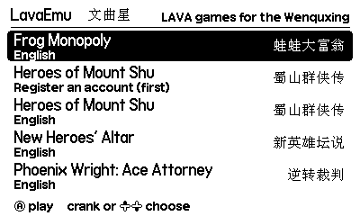
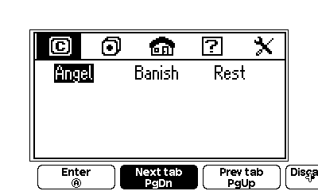
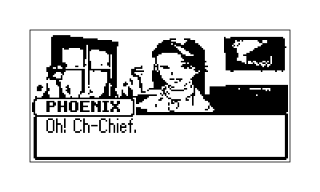
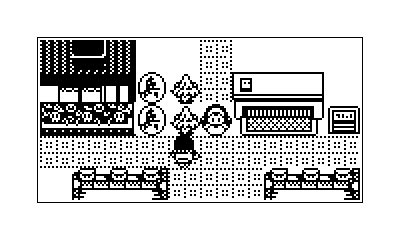
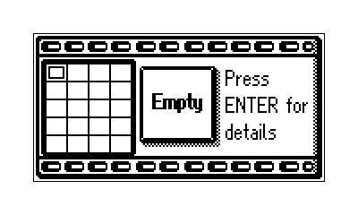
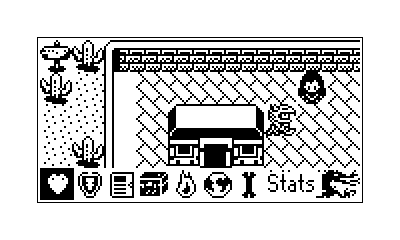
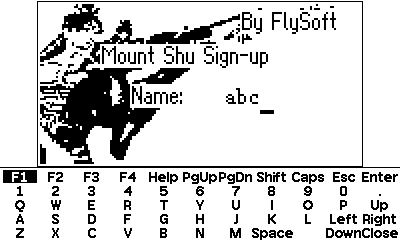
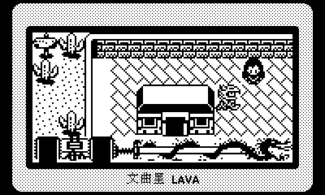
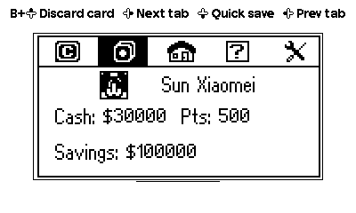
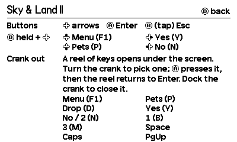

# LavaEmu for Playdate

> **Made with AI.** This port was written by an AI: Anthropic's Claude (Claude Code, running
> Claude Opus 5.5), directed by gopherbone. That covers the code, tests, build setup, screenshots
> and this README. Commits it made carry a `Co-Authored-By: Claude` trailer. It follows
> [bbk_playdate](https://github.com/gopherbone/bbk_playdate), the same author's port of BBKEmu,
> and borrows its frontend. Sources are credited [below](#credits).

Play Wenquxing (文曲星) **LAVA** games on a [Playdate](https://play.date). LAVA (GVmaker 1.0) is
the bytecode virtual machine BBK built into its NC2000/NC3000-era electronic dictionaries;
hobbyists wrote hundreds of games for it. LavaEmu is a small LAVA VM in plain C plus a Playdate
frontend. The VM is a port of wqx_tl's `lavaemu`, a Python VM from the MIT-licensed GVmakerSE
and MyGVM, and it runs in lockstep with lavaemu on every frame of the translations' QA routes
([Correctness](#correctness)).

**Status: works in the Playdate Simulator. Not yet run on a device.**

It comes with five English fan translations from the wqx_tl project:

| Game | Original | Notes |
|---|---|---|
| **Frog Monopoly** | 蛙蛙大富翁 1.1.2, Hao Xinli (Computer Frog), 2004 | Richman-style board game, 56 maps |
| **Phoenix Wright: Ace Attorney** | 逆转裁判, Ninja Eric (JunctionSoft), 2004 | the first case, ported from Capcom's GBA game |
| **New Heroes' Altar** | 新英雄坛说, Fanqinlue (Summer Loft), 2007 | GMUD-style wuxia sandbox |
| **Heroes of Mount Shu** | 蜀山群侠传, Shi Zehuan (FlySoft), 2006 | wuxia RPG; register an account first |
| **Sky & Land II: The Sealing Stone** | 幕天席地2：封印之石 1.3, LeeStorm (Molang Team), 2007 | real-time action RPG |

| | |
|---|---|
|  |  |
|  |  |
|  |  |
|  |  |
|  |  |

More in [docs/](docs): every game's title, the palettes, options, the performance overlay,
credits, and a Chinese original running on the VM's own fonts.

- The 160×80 LCD is drawn at 2× (320×160), with a white, black or Device border.
- Game saves (the games' own save files) go to the Data folder as they are written; 3
  save-state slots per game.
- Per-game key profiles: B + D-pad chords and a crank key palette, labelled with what the keys
  do in that game. An on-screen keyboard has every key, for names and passwords.
- Games you add get an automatic key profile from a scan of their bytecode.
- Options: border, speed (1×, 2×, 4×), performance overlay, save/load state, the key view,
  reset.

## Install

There is no release yet. Build it (see [Building](#building)), then copy `LavaEmu.pdx` to the
Playdate: sideload it at [play.date/account/sideload](https://play.date/account/sideload/) as a
zip, or put it in the `Games` folder of the Playdate's data disk.

To add games, run LavaEmu once so it creates its folders, then reboot the Playdate to its data
disk (Settings → System → Reboot to Data Disk) and open the folder in `Data/` ending in
`com.gopherbone.lavaemu` (sideloaded games get a `user.` prefix):

| Put this | Here |
|---|---|
| A game: its `.lav` program(s) and data files | `Games/<Name>/x.lav`, `Games/<Name>/LavaData/*.dat` |
| Optional: title, key profile, credit | `Games/<Name>/game.txt` (see below) |

Loose data files next to the `.lav` are mounted in `/LavaData/` too, and other subfolders
under their own names. A folder in `Games/` with the same name as a bundled game replaces it, so
you can drop in newer builds of the translations. Games that came as a `.pac` need unpacking
first (`python3 -m lavaemu` in wqx_tl reads them; `tools/bundle.py` shows how).

`game.txt` is optional:

```
title=Heroes of Mount Shu
title_gb=caf1c9bdc8bacfc0b4ab     (the Chinese title, GB2312 bytes in hex)
profile=shushan                   (a built-in key profile; leave out for the automatic one)
program=ShuHeroes.lav
program=ShuRegister.lav|Register an account (first)
credit=(c) 2006 Shi Zehuan, FlySoft.
```

Files the game writes go to `Saves/<Name>/` (the game's own path, `LavaData/...`), and save
states to `States/<Name>/<program>-slot<N>.state`. A file in `Saves` takes priority over the
bundled one, so deleting `Saves/<Name>` starts the game fresh.

## Controls

| Playdate | LAVA |
|---|---|
| D-pad | Arrow keys |
| Ⓐ | Enter (or the key picked on the crank palette) |
| Ⓑ, tapped | Esc (sent when B comes up) |
| Ⓑ held + D-pad | four game keys per game, shown above the screen while B is held |
| Crank out | the key palette: a reel of the game's keys under the screen. Turn to pick, Ⓐ presses |
| Menu → **keyboard** | every key, in a panel under the (moved-up) screen |
| Menu → **options** | save/load state, slot, border, speed, performance overlay, key view, reset |
| Menu → **game list** | back to the list |

What the chords and the palette send in each game (from the key view, Options → Keys):

| Game | Ⓑ + ⬆️ ➡️ ⬇️ ⬅️ | Palette |
|---|---|---|
| Frog Monopoly | Discard card, Next tab, Quick save, Prev tab | Next/Prev tab, Discard, Yes, No, Back, Quick save, Quick load, Quit menu, Help |
| Ace Attorney | Court Record | Court Record |
| New Heroes' Altar | Yes, –, No, – | Yes, No, Challenge, Kill, Head/Body/Hand/Feet off, Reset keys |
| Heroes of Mount Shu | Gear, Items, Status, Arts (F1–F4) | Gear, Items / Del, Status, Arts, Points, Yes, No, Caps, Shift |
| Sky & Land II | Menu (F1), Yes, Pets, No | Menu, Pets, Drop, Yes, No / 2, 1, 3, Space, Caps, PgUp |
| any other game | F1–F4 | every key its code compares a key against |

Each palette also has Enter (where it rests) and Keyboard (every key) at its ends.

A tapped key stays down until the game has seen it (read it, or found it held when it polled),
for at most half a second, so quick taps aren't lost while a game is busy and aren't read
twice. Held arrows repeat after 0.3 s for games that read keys one at a time.

## The input design

LAVA games were written for a dictionary keyboard: arrows, Enter, Esc, F1–F4, PgUp/PgDn, Help,
Shift/Caps, 26 letters and 10 digits. The Playdate has a D-pad, two buttons and a crank.

**Which keys do the games actually use?** The C VM can log every comparison a game makes
against a key it just read (getchar, Inkey, GetWord or CheckKey(128)) and every key it polls
with CheckKey. `tests/lockstep.py --keys` runs each game's QA routes with that log on
(`tools/keyreport.py` summarises it), and `tools/keystatic.py` lists the key constants in every
function that reads keys, for branches the routes never took. `tools/keyshots.py` then presses
each candidate key from a mid-game state and screenshots the result, which is where the labels
come from: Frog Monopoly's PgUp/PgDn page the menu tabs and `s`/`r` quick-save and quick-load on
the map, Heroes of Mount Shu has F1–F4 for Gear/Items/Status/Arts and `p` for points, Sky &
Land opens its menu with F1 and types number choices with B N M (1 2 3), Ace Attorney only
adds R (Court Record), and New Heroes' Altar uses letters only inside fight mode and the gear
page. Two of the games need text entry: account names, and a password in Mount Shu.

**What it does:** three layers, from fastest to most complete.

1. **Buttons**: D-pad, Ⓐ = Enter, Ⓑ = Esc cover most play in every game.
2. **Ⓑ + D-pad chords** for the four keys each game uses most. Holding B shows the four
   labels above the screen. Esc is sent when B is released without a direction, which costs a
   few frames of latency on Esc but nothing else.
3. **The crank palette** for the rest. Undocking the crank opens a slim reel of labelled keys
   in the border under the screen, so the game stays fully visible at 2×. Turning the crank
   moves along it, one key per 24°, and Ⓐ presses the selected key; the key is held as long as
   Ⓐ is, which matters for games that poll with CheckKey. After the press the reel springs
   back to **Enter**, so Ⓐ is Enter again for the next menu and the next press of a palette
   key is one notch away. Docking closes it. The reel's last item opens the **keyboard**
   panel, with every LAVA key for typing names, which is also in the system menu.

**Alternatives tried or considered:**

- *A full-screen keypad* (bbk_playdate's): every key, but it hides the game, so you can't see
  the prompt you're answering. Kept as the keyboard panel, which moves the screen up instead.
- *Palette with a sticky selection* (Ⓐ sends the selected key until you crank back): you lose
  Enter in the middle of a menu you just opened with the palette key (Frog's tabs, Sky & Land's
  F1 menu). The spring-back to Enter fixed this; repeating a key costs one notch of crank.
- *One-shot palette that closes after a press*: then the next key needs a dock/undock cycle.
- *Crank as PgUp/PgDn* (scroll through pages): only Frog Monopoly pages lists, its chords
  already have Next/Prev tab, and it would fight the palette for the crank.
- *A side panel instead of the bottom band*: it would need the screen at less than 2× or
  off-centre; the bottom band fits a five-key reel at full size.
- *More chords* (A + D-pad, or chords on the crank): A must stay a plain Enter for games that
  poll it, and two chord sets were hard to remember.
- *Raw key names on the palette*: "F2" means Items in one game and Discard card in another;
  the labels come from the profile, with the key name underneath.

## Performance

The VM is time-budgeted: like lavaemu, an instruction costs 4 µs of virtual time and Delay(ms)
adds its milliseconds, so a game never executes more than 4,166 instructions per 1/60 s frame.
The frontend runs at 30 fps and runs as many 60 Hz VM frames as real time has passed (two per
update; 4 or 8 at 2× or 4× speed). Getms and GetTime follow the virtual clock and the Playdate's
clock.

Measured on an Apple-silicon Mac (`make bench`, built `-Os` like the device; `tests/lockstep.py
--timing` for every frame of the QA routes):

| Case | Host time per VM frame |
|---|---|
| Waiting for a key (most of every game) | 0.1–0.3 µs |
| Full budget of plain bytecode (New Heroes' Altar's map, Mount Shu's menus) | 8–42 µs |
| Sky & Land II's title loop: ~115 full-screen WriteBlocks per frame | 78 µs (330 µs before the blit rewrite) |
| Rendering the LCD (changed rows only) | under 1 µs in the Simulator |

The device estimate scales by bbk_playdate's own calibration: its fast 6502 core takes 0.080 ms
per frame on this Mac and 14 ms on a Rev B Playdate on the same title-screen workload (about
175×). That puts ordinary frames well under 2 ms, Mount Shu's menus near 7 ms, and the worst
case, Sky & Land's title animation, near 14 ms per VM frame against 16.7 ms. If the VM can't keep
up, the frame loop is time-boxed (24 ms per update), so a heavy stretch runs slower instead of the
Playdate dropping to a few updates a second. These are estimates; turn on **Show performance**
in options to see the real figure (VM time per frame, its share of the 16.7 ms, instructions
per frame, draw time, fps, and a `bench` average of frames 300–599).

What bbk_playdate learned about the Playdate (slow PSRAM, a cache miss costs about 0.9 µs, an
8 KB fast stack) shaped the code:

- **One interpreter loop** keeps pc, the stack pointer, the last value, the frame base and end
  and the instruction budget in locals for the whole frame, and writes them back only around
  system calls.
- **Blits as funnel shifts** with the mode switch outside the inner loop and a fused path for
  plain copies; mirrored blocks alone go pixel by pixel.
- **Rendering only rows that changed** (a 1,600-byte copy of the last LCD), each byte doubled to
  16 pixels through a 256-entry table.
- **No copies of data files**: files and open handles share their bytes copy-on-write, so
  New Heroes' Altar's 600 KB data file opened read-write costs nothing until written. Save states
  store such handles as references (about 66 KB a state).
- **`-Os`** for the device build.

Memory: the VM state is about 200 KB (the 64 KB LAVA address space plus slack and the stack),
GVmakerSE's fonts 430 KB, and a game's files up to 650 KB (New Heroes' Altar).

## Correctness

`make check` runs `tests/test_states.py` (save-state round trips: play, save, play on, load
into a fresh VM, replay, compare every frame) and `tests/lockstep.py`, the lockstep test:

- It drives the five games' own QA routes from wqx_tl (`docs/<game>/routes/`, through each
  game's `qa.py`), on the English build **and** the Chinese original.
- Every frame lavaemu runs, the C VM (`host/liblava.dylib` through ctypes) runs the same frame,
  and the two are compared: all 64 KB of memory (so the LCD and the off-screen buffer),
  registers, the stack, keys, open files and the whole file table.
- The QA drivers sometimes reach into the VM between frames (cheats that poke memory, restored
  snapshots); the harness notices a state the C VM didn't produce and copies it across. When a
  Python callback changes the VM inside a frame (Mount Shu's driver releases keys mid-frame)
  the frame is counted as "tainted" and skipped instead.

Result: **0 divergences** in about 507,000 frames (Frog 6k, Ace 99k, New Heroes 117k, Mount Shu
122k, Sky & Land 164k), with under 0.3% of frames tainted. The harness itself was checked by
breaking the C VM on purpose (a different rand() increment, a short ClearScreen): it reported
1,224 divergent frames on two Frog routes. Divergent frames are saved with the state before
them (`host/lockstep/`), to replay instruction by instruction.

The port mirrors lavaemu down to its Python integer semantics: which addresses are masked to
16 bits and which aren't, the 16 bytes of slack after memory, GVmaker's font row quirk, the
string-literal ring, signed division, and the virtual-time accounting around system calls.
Known edges where it doesn't: values outside 32 bits (a `>> 0` on a negative number, `INT_MIN
/ -1`) and memory slices running off the end of the 64 KB space, which Python grows and C clamps.

## Building

Requires the [Playdate SDK](https://play.date/dev/) and, for device builds, Arm's GNU toolchain
(`brew install --cask gcc-arm-embedded`; Homebrew's bare `arm-none-eabi-gcc` lacks the C library).
The bundled games come from a local [wqx_tl](#credits) checkout:

```sh
make games        # copy the English builds from ~/wqx_tl (WQX_TL=...) into games/; ORIGINALS=1 adds the Chinese originals
make              # LavaEmu.pdx for the device and the Simulator
make run          # open it in the Simulator
make check        # save-state test + lockstep against lavaemu (needs ~/wqx_tl)
make bench        # host benchmark of the VM on each game
make autotest     # Simulator build that plays every game, writes screenshots and timings to
                  # the Simulator's Data/com.gopherbone.lavaemu/autotest/; tools/shots.py converts them
```

`games/` (and `Source/Bundled/`, its copy in the pdx) is gitignored: no game files are committed.
Rebuild the translations in wqx_tl with `python3 -m <key>.build` first if they changed.

### Layout

- `src/lava.c`, `lava.h`: the VM. No Playdate dependencies.
- `src/profiles.c`: the per-game key profiles and the automatic one.
- `src/main.c`: the frontend (list, loop, input, options, key view, credits, autotest).
- `Source/fonts/`: GVmakerSE's GB2312 and ASCII fonts (MIT, with its licence).
- `tests/`: `lavac.py` (ctypes binding and state transfer), `lockstep.py`, `test_states.py`.
- `tools/`: `lavahost.c` (the host library), `bench.c`, `bundle.py`, the key-usage tools
  (`keyreport.py`, `keystatic.py`, `keyshots.py`) and `shots.py`.

### Extending

wqx_tl's lavaemu is growing grey-scale (4-level) graphics, newer LavaX system calls and
per-model screen sizes for games like Princess Maker 4. The VM keeps the screen geometry in
`LAVA_W/LAVA_H/LAVA_BPL` and the LCD/buffer addresses in one place, and unknown system calls stop
the game with a message naming the call, so adding them is a matter of new `sys_call` cases.
Grey levels would render through the frontend's row expansion table, as 2×2 patterns (or
bbk_playdate's dithering). New translations bundle by adding a line to `tools/bundle.py`; without
a profile they get the automatic one.

## Credits

- **The VM** follows **GVmaker** by Eastsun (2008) as published in **arucil/GVmakerSE** (MIT,
  (c) 2018 plodsoft) and **arucil/MyGVM** (MIT, (c) 2018 plodsoft), by way of **lavaemu** in
  wqx_tl, which this is a port of. The fonts in `Source/fonts/` are GVmakerSE's (MIT; licence
  alongside).
- **The games**: 蛙蛙大富翁 by Hao Xinli (Computer Frog), DATE Soft Studio, with maps by the
  authors in its map list; 逆转裁判 by Ninja Eric (忍者Eric), JunctionSoft, after Capcom's
  Ace Attorney; 新英雄坛说 by Fanqinlue (反侵略), Summer Loft (避暑阁楼); 蜀山群侠传 by Shi
  Zehuan (史泽寰), FlySoft (飞翔软件); 幕天席地2：封印之石 by LeeStorm, Molang Team (末浪小组),
  with mini-games by Yoshinhwa.
- **The English translations**: the wqx_tl project. Their text is drawn in **bbk_tl Sans**, the
  proportional pixel font from the bbk_tl translation project, by small text routines written in
  LAVA bytecode inside each game.
- **bbk_playdate** (and wqx_playdate): the frontend's structure, file layout, keypad idea, Device
  border and performance lessons.
- [Playdate SDK](https://play.date/dev/) by Panic: the C API, build rules and system fonts.

## License

The code is GPL-3.0-or-later (`LICENSE`), as lavaemu and bbk_playdate are. The games belong to
their authors; the English versions are unofficial, non-commercial fan translations. Frog
Monopoly's copyright page asks that the game not be modified without the author's consent; the
translation is shared as patches by wqx_tl, and this repository contains no game files.
